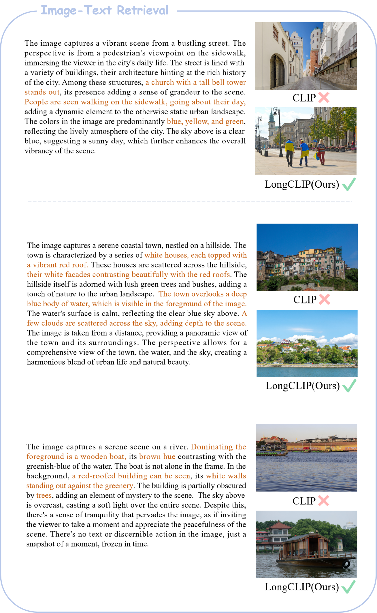
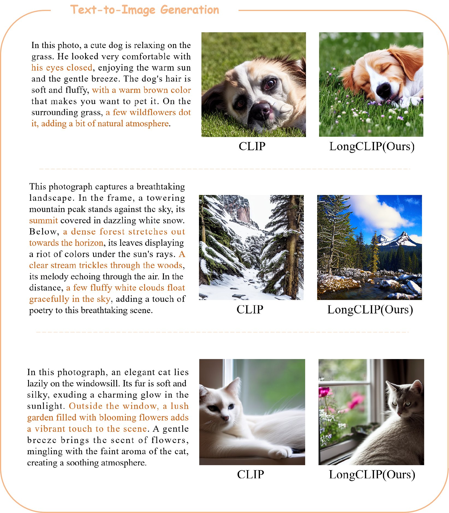

# Long-CLIP
This repository is the official implementation of Long-CLIP

**Long-CLIP: Unlocking the Long-Text Capability of CLIP**\
[Beichen Zhang](https://beichenzbc.github.io), [Pan Zhang](https://panzhang0212.github.io/), [Xiaoyi Dong](https://lightdxy.github.io/), [Yuhang Zang](https://yuhangzang.github.io/), [Jiaqi Wang](https://myownskyw7.github.io/)

## 💡 Highlights
- 🔥 **Long Input length** Increase the maximum input length of CLIP from **77** to **248**.
- 🔥 **Strong Performace** Improve the R@5 of long-caption text-image retrieval by **20%** and traditional text-image retrieval by **6%**.
- 🔥 **Plug-in and play** Can be directly applied in **any work** that requires long-text capability.


## 📜 News
🚀 [2024/7/3] Our paper has been accepted by ***ECCV2024***.

🚀 [2024/7/3] We release the code of using Long-CLIP in ***SDXL***. For detailed information, you may refer to `SDXL/SDXL.md`.

🚀 [2024/5/21] We update the paper and checkpoints after fixing the bug in DDP and add results in Urban-1k. Special thanks to @MajorDavidZhang for finding and refining this bug in DDP! Now the fine-tuning only takes ***0.5*** hours on *8 GPUs*!

🚀 [2024/5/21] Urban-1k: a scaling-up version of Urban-200 dataset in the paper has been released at this [page](https://huggingface.co/datasets/BeichenZhang/Urban1k).

🚀 [2024/4/1] The training code is released!

🚀 [2024/3/25] The Inference code and models ([LongCLIP-B](https://huggingface.co/BeichenZhang/LongCLIP-B) and [LongCLIP-L](https://huggingface.co/BeichenZhang/LongCLIP-L)) are released!

🚀 [2024/3/25] The [paper](https://arxiv.org/abs/2403.15378) is released!

## 👨‍💻 Todo
- [x] Training code for Long-CLIP based on OpenAI-CLIP
- [x] Evaluation code for Long-CLIP
- [x] evaluation code for zero-shot classification and text-image retrieval tasks.
- [x] Usage example of Long-CLIP
- [x] Checkpoints of Long-CLIP


## 🛠️ Usage

### Installation

Our model is based on [CLIP](https://github.com/openai/CLIP), please prepare environment for CLIP.


### how to use

Please first clone our [repo](https://github.com/beichenzbc/Long-CLIP) from github by running the following command.

```shell
git clone https://github.com/beichenzbc/Long-CLIP.git
cd Long-CLIP
```

Then, download the checkpoints of our model [LongCLIP-B](https://huggingface.co/BeichenZhang/LongCLIP-B) and/or [LongCLIP-L](https://huggingface.co/BeichenZhang/LongCLIP-L) and place it under `./checkpoints`

```python
from model import longclip
import torch
from PIL import Image

device = "cuda" if torch.cuda.is_available() else "cpu"
model, preprocess = longclip.load("./checkpoints/longclip-B.pt", device=device)

text = longclip.tokenize(["A man is crossing the street with a red car parked nearby.", "A man is driving a car in an urban scene."]).to(device)
image = preprocess(Image.open("./img/demo.png")).unsqueeze(0).to(device)

with torch.no_grad():
    image_features = model.encode_image(image)
    text_features = model.encode_text(text)
    
    logits_per_image = image_features @ text_features.T
    probs = logits_per_image.softmax(dim=-1).cpu().numpy()

print("Label probs:", probs) 
```

### Evaluation
#### Zero-shot classification

To run zero-shot classification on imagenet dataset, run the following command after preparing the data
```shell
cd eval/classification/imagenet
python imagenet.py
```

Similarly, run the following command for cifar datset
```shell
cd eval/classification/cifar
python cifar10.py               #cifar10
python cifar100.py              #cifar100
```

#### Retrieval
To run text-image retrieval on COCO2017 or Flickr30k, run the following command after preparing the data
```shell
cd eval/retrieval
python coco.py                  #COCO2017
python flickr30k.py             #Flickr30k
```
### Traning
Please refer to `train/train.md` for training details.

## ⭐ Demos
### Long-CLIP-SDXL
<p align="center"> <a>  

</a> </p>

### Long-caption text-image retrieval 
<p align="center"> <a>  

</a> </p>

### Plug-and-Play text to image generation 
<p align="center"> <a>  

</a> </p>


## Citation
If you find our work helpful for your research, please consider giving a citation:
```
@article{zhang2024longclip,
        title={Long-CLIP: Unlocking the Long-Text Capability of CLIP},
        author={Beichen Zhang and Pan Zhang and Xiaoyi Dong and Yuhang Zang and Jiaqi Wang},
        journal={arXiv preprint arXiv:2403.15378},
        year={2024}
}
```
